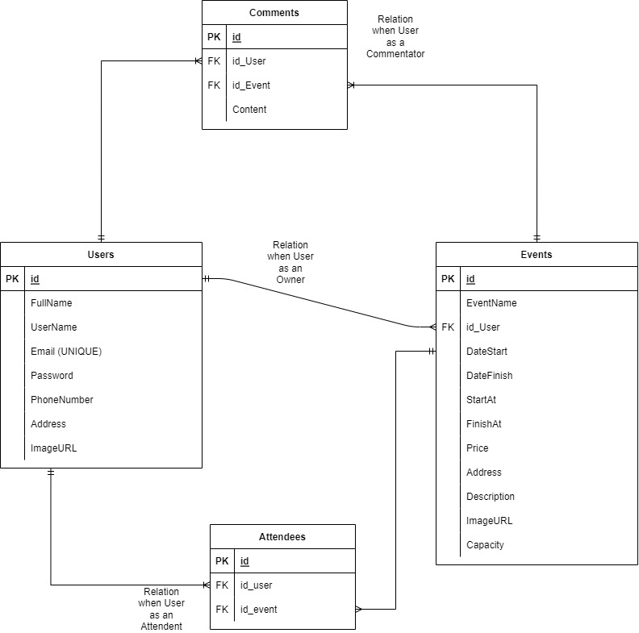

# EVENT.

<!-- PROJECT LOGO -->
 

  <h3 align="center">Project-3 "EVENT." Event Planning App </h3>

  

    Project ke 3 Pembangunan RESTful API Program Immersive Back End Batch 9
     
    <a href="https://github.com/Alta-Group-Project1/BE-Group1"><strong>Kunjungi kami »</strong></a>
     
  

<!-- ABOUT THE PROJECT -->
### 💻 &nbsp;About The Project

EVENT. merupakan project ke 3 untuk membangun sebuah RESTful API Event Planning App dengan menggunakan bahasa Golang.    
Dilengkapi dengan berbagai fitur yang memungkinkan user untuk mengakses data yang ada didalam server, mulai dari membuat akun hingga membuat event yang akan diselenggarakan oleh user. 
Adapun fitur yang ada dalam RESTful API kami antara lain :

      

🙎 User

  
  <!---
  | Command | Description |
| --- | --- |
  --->
  
 User dapat membuat Akun dan Login, agar mendapat legalitas untuk mengakses berbagai fitur lain di aplikasi ini. 
 Terdapat juga fitur Update untuk mengedit data yang berkaitan dengan user, serta fitur delete jika user menginginkan akunnya dihapus.
 

  
| Feature User | Endpoint | Param | JWT Token | Fungsi |
| --- | --- | --- | --- | --- |
| POST | /users  | - | NO | Melakukan proses registrasi user |
| POST | /login | - | NO | Melakukan proses login user |
| GET | /users | - | YES | Mendapatkan informasi akun user yang sedang login |
| PUT | /users | - | YES | Melakukan update informasi akun user yang sedang login | 
| DEL | /users | - | YES | Menghapus akun user yang sedang login |

  

🎉 &nbsp;Event

  
  <!---
  | Command | Description |
| --- | --- |
  --->
  
User dapat menyelenggarakan eventnya sendiri yang bisa diikuti oleh orang lain. Beberapa fitur yang lain ialah User dapat mengupdate dan menghapus event yang ia buat, User juga dapat melihat detail event yang ada di aplikasi tersebut. 
  
| Feature Event | Endpoint | Param | JWT Token | Fungsi |
| --- | --- | --- | --- | --- |
| GET | /events  | - | NO | Mendapatkan informasi seluruh event yang ada |
| GET | /events/:idEvent | idEvent | NO | Mendapatkan informasi event secara detail melalui id event |
| GET | /events/mylists | - | YES | Mendapatkan informasi seluruh event user yang ia selenggarakan |
| POST | /events | - | YES | YES | Membuat event baru |
| DELETE | /events/:idEvent | idEvent | YES | Melakukan delete event yang diselenggarakan oleh user berdasarkan id event |
| PUT |  /events/:idEvent | idEvent | YES | Melakukan update event tertentu yang diselenggarakan oleh user berdasarkan id event |

💬 &nbsp;Comment

  
  <!---
  | Command | Description |
| --- | --- |
  --->
Comment merupakan fitur dimana user dapat memberikan comment/komentar pada event yang tersedia dan komentar tersebut dapat dilihat juga oleh user yang lain.

| Feature comment | Endpoint | Param | JWT Token | Fungsi |
| --- | --- | --- | --- | --- |
| POST | /comments | - | YES | Memberikan comment/komentar pada event yang ada |
| GET | /comments/:idEvent | idEvent | YES | Menampilkan comment/komentar yang ada pada suatu event berdasarkan id event |

🗓&nbsp;Attendees

  
  <!---
  | Command | Description |
| --- | --- |
  --->

Fitur attendees merupakan fitur untuk users bisa bergabung untuk mengikuti event yang telah dibuat oleh user lainnya di website Event ini, adapun fiturnya ada POST dimana user bisa membuat daftar event yang akan diikutinya, juga ada fitur Get Attendees yang berfungsi untuk menampilkan atau memberi informasi pada suatu event itu terdapat user siapa saja yang mengikuti event, juga bisa melihat daftar event yang akan diikuti oleh user berdasarkan join event yang dilakukan sebelumnya dengan fitur Post Attendee. User juga bisa cancel event apabila ia berubah pikiran untuk tidak mengikuti event yang tadinya akan ia ikuti dengan fitur Delete Attendee.

| Feature attendees | Endpoint | Param | JWT Token | Fungsi |
| --- | --- | --- | --- | --- |
| POST | /attendees/events | idEvent | YES | Membuat daftar event yang akan diikuti/join event |
| GET | /attendees/events| idEvent | YES | Mendapatkan informasi user yang mengikuti berdasar event yang sama yang akan diikuti |
| DELETE | /attendees/events | idEvent | YES | Meng-cancel event yang akan diikuti apabila berubah pikiran |
| GET | /attendees/USERS | - | YES | Mendapatkan informasi event apa saja yang akan diikuti berdasarkan post attenddes event yang telah dilakukan |

<!-- IMAGES -->
### 🖼&nbsp;Images

📈&nbsp;ERD

<!-- CONTACT -->
### Contact

:copyright: 2022 | Faizal Tyas Rafki

</h3>